<h3><code>hafiz@github ~ $ ./contributions.sh</code></h3>

  

<h3><code>hafiz@github ~ $ whoami</code></h3>
<table>
  <tr>
    <td valign="top"></td>
    <td valign="top"></td>
  </tr>
</table>

 

### Mohammad Hafizur Rahman Sakib
CS student · Full-stack + ML · Competitive programmer

 

<h3><code>hafiz@github ~ $ ls projects/</code></h3>

| Project | Stack | Link |
|---|---|---|
| **AlgoViz** | React · TypeScript · TanStack Router · Framer Motion | [algorithm-hunter.vercel.app](https://algorithm-hunter.vercel.app) |
| **NOVA MathPlot** | React · Three.js · mathjs | [nova-mathplot.vercel.app](https://nova-mathplot.vercel.app) |
| **SubCalcPro** | FLSM/VLSM subnet calculator | GitHub |
| **Sababa Tours** | React · Firebase Auth | GitHub |

 

<h3><code>hafiz@github ~ $ neofetch --stats</code></h3>

 

 

 

<!--
Regeneration:
  static art (change only when photo/details change):
    python scripts/prep_photo.py your-photo.jpg
    python scripts/make_ascii_svg.py
    python scripts/make_info_card.py
  live art (auto-refreshed daily by .github/workflows/update-profile-art.yml):
    python scripts/fetch_contributions.py
    python scripts/render_heatmap_svg.py
-->
